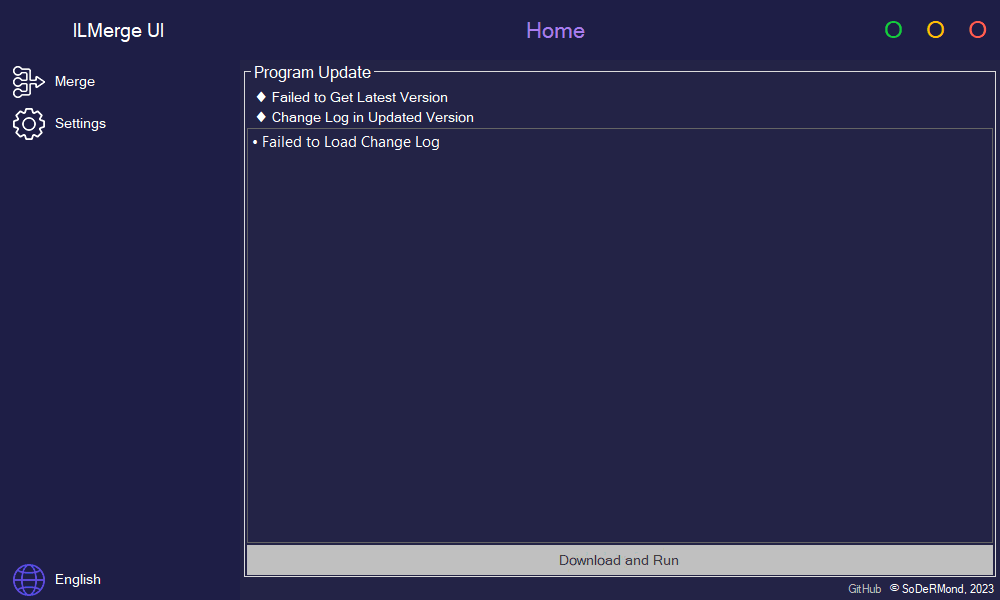

	
	<h1>ILMerge UI</h1>

	
	
	

 

	<a href="#-functions">Functions</a> •
	<a href="#-note">Note</a> •
	<a href="#-downloading">Downloading</a> •
	<a href="#-license">License</a>

***

	

***

## ♦ Functions

- Home
	- Program Update
		- Update Status Information
		- Change Log
		- Button to Download and Run the Latest Version
	- Bottom
		- GitHub Link
		- Copyright Information
- Merge
	- Paths - <b>Double-Click to Change</b>
		- Input
		- Output
		- Libraries
	- List of Libraries
	- Button to Refresh the List
	- Button to Delete the Library
	- Button to Start the Merge
- Settings
	- Save Path - <b>Double-Click to Change</b>
	- Automatic Program Updates
	- Button to Deleting Saved Program Files
	- Saving a .pdb File After Merging
- Button to Switching Languages

***

## ♦ Note

• Works Only With Libraries as References

***

## ♦ Downloading

• Go to the [Releases Page](https://github.com/SoDeRMond/ILMergeUI/releases) to Download the Archive
 • Extract the Archive to Your Desktop
 • Run ILMerge UI.exe

***

## ♦ License

• ILMerge UI are Distributed Under the GPL-3.0 License